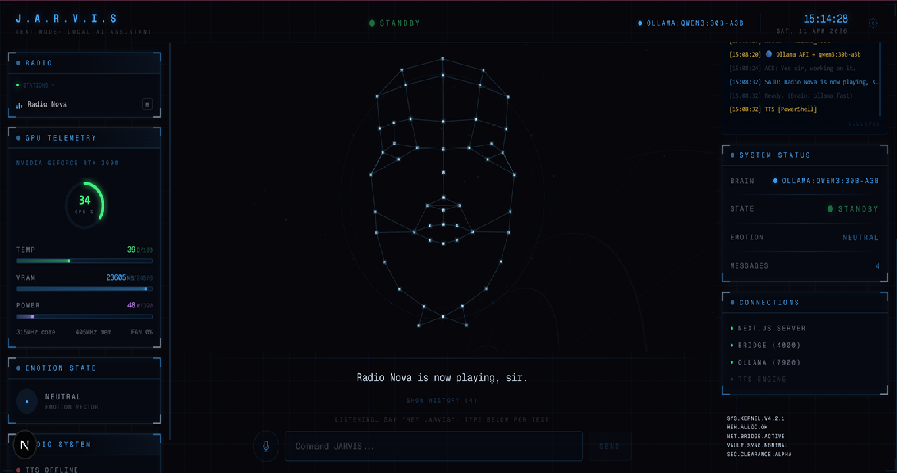

# J.A.R.V.I.S OS

**Just A Rather Very Intelligent System** — A fully local AI assistant with modular skill architecture.

Built by [Sami Porokka](https://poro-it.com) / Poro-IT OÜ

---



## Features

- **Multi-Model Routing** — Queries routed to the best local model (fast / reason / code / deep / cloud)
- **ReAct Agent Loop** — Think → Tool → Observe → Repeat until task complete
- **Modular Skills** — 13 plug-and-play skill modules with 25+ tools, enable/disable via config
- **Voice I/O** — Wake word "Hey JARVIS", Whisper STT, Orpheus TTS with 5.1 center-channel output
- **Persistent Memory** — [MemPalace](https://github.com/milla-jovovich/mempalace) vector DB + Obsidian vault (2000+ memories)
- **Stark Industries HUD** — Next.js holographic dashboard with GPU monitor, live system log
- **Home Automation** — Denon AVR, NVIDIA Shield, LG TV, Panasonic Blu-ray, internet radio
- **34 Claude Skills** — Frontend design, SEO, Playwright, React, and more loaded on demand

---

## Architecture

```
Voice / Browser / Text
        │
   ┌────▼────┐
   │ Watcher  │──── input.txt ──── server.py (:4000)
   └────┬────┘                     Browser UI
        │
   ┌────▼────────┐
   �� Router       │ Keywords → fast / reason / code / deep / claude
   └────┬────────┘
        │
   ┌────▼──────────────┐
   │ ReAct Server :7900 │ Tool-augmented Ollama proxy
   │  ├ Planner (8b)    │ Picks which tools are needed
   │  ├ Skill Loader    │ Loads skills/*.py dynamically
   │  └ Loop (max 5)    │ Repeat until final answer
   └────┬──────────────┘
        │
   ┌────▼────┐    ┌──────────┐
   │ Ollama   │    │ Claude   │
   │ :11434   │    │ --print  │
   └─────────┘    └────��─────┘
```

---

## Skills

JARVIS uses a modular skill system. Each skill is a self-contained Python module in `skills/` that registers its own tools, keywords, and executors. Drop a file in → restart → it's live.

| Skill | Tools | Description | Docs |
|-------|-------|-------------|------|
| **denon** | `denon_input` `denon_volume` `denon_preset` `denon_surround` `denon_power` | Denon AVR-X4100W receiver control | [Guide](docs/skills/denon.md) |
| **shield** | `room_command` `scan_network` | NVIDIA Shield TV per-room control | [Guide](docs/skills/shield.md) |
| **radio** | `play_radio` | Internet radio streaming via mpv | [Guide](docs/skills/radio.md) |
| **volume** | `set_volume` | Windows system volume control | [Guide](docs/skills/volume.md) |
| **timer** | `set_timer` | Countdown timers with voice alerts | [Guide](docs/skills/timer.md) |
| **memory** | `memory_search` `memory_add` `memory_status` | MemPalace long-term memory | [Guide](docs/skills/memory.md) |
| **vault** | `read_vault_file` `list_vault_dir` | Obsidian vault file access | [Guide](docs/skills/vault.md) |
| **web** | `web_search` `open_url` | DuckDuckGo search + browser | [Guide](docs/skills/web.md) |
| **shell** | `shell_command` `read_file` | Safe shell execution + file reading | [Guide](docs/skills/shell.md) |
| **claude_skills** | `list_skills` `use_skill` | Browse/load 34 Claude Code skills | [Guide](docs/skills/claude_skills.md) |
| **lg_tv** | `lg_tv` | LG webOS TV — power, volume, inputs, apps | [Guide](docs/skills/lg_tv.md) |
| **panasonic_bd** | `bluray` | Panasonic UB9000 4K Blu-ray — play, pause, chapters | [Guide](docs/skills/panasonic_bd.md) |
| **network** | `scan_network` | Network scan with device identification + topology map | [Guide](docs/skills/network.md) |

**Full skill system documentation:** [docs/SKILLS.md](docs/SKILLS.md)

---

## Models

| Slot | Model | Size | Use Case |
|------|-------|------|----------|
| Fast | qwen3:8b | 5 GB | Casual chat, quick answers |
| Reason | qwen3:30b-a3b | 18 GB | Analysis, research, tool use |
| Code | qwen3-coder:30b | 18 GB | Code tasks, debugging |
| Deep | qwen3:30b-a3b | 18 GB | Strategy, deep analysis |
| Cloud | Claude Code | API | Complex code tasks |

---

## Prerequisites

- **NVIDIA GPU** with CUDA (tested on RTX 3090 24GB)
- **Node.js 20+**
- **Python 3.12+**
- **Ollama**

---

## Installation

### Windows 11 + WSL2 (Recommended)

```powershell
git clone https://github.com/porokka/jarvis-os.git
cd jarvis-os
.\install-windows.ps1
```

### Native Linux (Ubuntu 22.04+ / Debian 12+)

```bash
git clone https://github.com/porokka/jarvis-os.git
cd jarvis-os
bash install-linux.sh
```

Both installers handle: system packages, Python deps, Ollama + model pulls, Next.js app, MemPalace, vault setup.

### Post-Install

```bash
# Start backend
bash jarvis.sh start

# Start HUD (separate terminal)
cd app && npm run dev
# Open http://localhost:3000
```

---

## Usage

### Start / Stop / Status

```bash
bash jarvis.sh start     # Boot everything
bash jarvis.sh stop      # Shut down
bash jarvis.sh status    # Health check
bash jarvis.sh restart   # Restart all services
```

### Voice

```bash
python3 scripts/voice_capture.py          # Always-on mode
python3 scripts/voice_capture.py --wake   # Wake word mode ("Hey JARVIS")
```

### TTS (Optional — Orpheus 3B)

```bash
python3 tts/setup.py     # Download model (~3GB VRAM)
python3 tts/server.py    # Start on :5100
```

---

## Interfaces

| Interface | URL | Description |
|-----------|-----|-------------|
| **Stark HUD** | http://localhost:3000 | Next.js holographic dashboard |
| **Browser UI** | http://localhost:4000 | Simple browser voice UI |
| **ReAct API** | http://localhost:7900 | Tool-augmented Ollama proxy |
| **Orpheus TTS** | http://localhost:5100 | Local TTS server (optional) |

### API Endpoints

```
POST /api/chat          ReAct loop with tools (Ollama-compatible)
GET  /api/health        Health check
GET  /api/skills        List loaded skills and their tools
GET  /api/timers        Active countdown timers
```

---

## File Structure

```
jarvis-os/
├── jarvis.sh                  # Start/stop/restart/status
├── JARVIS.md                  # Personality file
├── scripts/
│   ├── watcher.sh             # Router + orchestrator
│   ├── react_server.py        # ReAct loop + skill loader (315 lines)
│   ├── server.py              # Browser bridge HTTP server
│   ├── voice_capture.py       # Whisper STT with wake word
│   └── system_api.py          # System-level APIs
├── skills/                    # ← Modular skill modules
│   ├── __init__.py
│   ├── loader.py              # Dynamic discovery + import
│   ├── denon.py               # Denon AVR receiver
│   ├── shield.py              # NVIDIA Shield rooms
│   ├── radio.py               # Internet radio
│   ├── volume.py              # System volume
│   ├── timer.py               # Countdown timers
│   ├── memory.py              # MemPalace memory
│   ├── vault.py               # Obsidian vault
│   ├── web.py                 # Web search + URLs
│   ├── shell.py               # Shell + file reading
│   └── claude_skills.py       # Claude skill browser
├── config/
│   ├── skills.json            # Enable/disable skills
│   └── denon.json             # Denon AVR device config
├── app/                       # Next.js Stark Industries HUD
│   ├── app/
│   │   ├── page.tsx           # Main HUD dashboard
│   │   ├── components/        # GPU monitor, system log, timers, etc.
│   │   └── api/               # Next.js API routes
│   └── lib/
│       └── bridge.ts          # Claude/Ollama bridge
├── tts/                       # Orpheus 3B TTS server
│   ├── server.py
│   ├── engine.py
│   └── setup.py
├── docs/
│   ├── ARCHITECTURE.md        # Full system architecture
│   ├── SKILLS.md              # Skill system guide
│   └── skills/                # Per-skill documentation
└── vault/                     # Embedded vault context
```

---

## Personality Modes

| Mode | Character | Address |
|------|-----------|---------|
| J.A.R.V.I.S | British butler, dry wit | "sir" |
| F.R.I.D.A.Y | Casual, friendly | First name |
| E.D.I.T.H | Direct, tactical | "boss" |
| HAL 9000 | Calm, unsettling | "Dave" |

---

## Example Commands

```
"Play Nova radio"
"Switch Denon to PC"
"Put on headphones mode"
"Play Metallica on Spotify in the living room"
"Set a timer for 10 minutes — pasta is ready"
"Search for latest Next.js 15 features"
"What do you remember about StockWatch?"
"Turn the volume to 40%"
"Set surround mode to stereo"
"Scan the network for devices"
```

---

## License

MIT License — see [LICENSE](LICENSE) for details.
